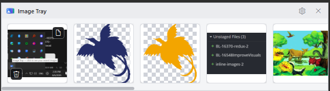
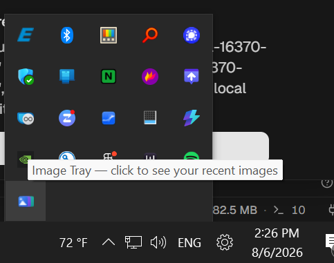

# Image Tray

A small vibe-coded Windows app that keeps your recent screenshots in a strip, one click away from
the clipboard.

It watches whichever folder your screenshot tool saves into. It watches the clipboard too, so a
snip you only ever copied gets saved into that folder and appears in the strip with everything
else. Copying an image file, or a path to one, does the same.

It lives in the notification area. Click the icon to bring the strip up.

